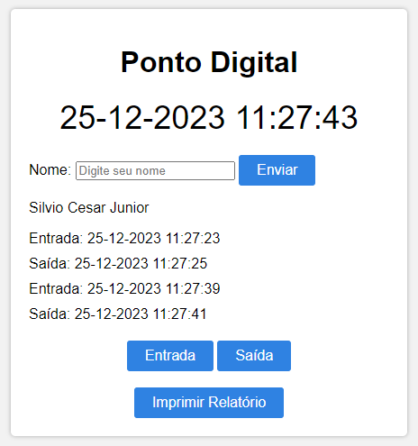

<h1 align="center"> Ponto Digital </h1>

Sistema de ponto digital prático com entrada/saída, possibilitando a geração de PDF personalizado, garantindo a integridade do documento.    

  <a href="#-tecnologias">Tecnologias</a>&nbsp;&nbsp;&nbsp;|&nbsp;&nbsp;&nbsp;
  <a href="#-projeto">Projeto</a>&nbsp;&nbsp;&nbsp;|&nbsp;&nbsp;&nbsp;
  <a href="#-layout">Layout</a>&nbsp;&nbsp;&nbsp;|&nbsp;&nbsp;&nbsp;

 

  

## 🚀 Tecnologias

Esse projeto foi desenvolvido com as seguintes tecnologias:

- HTML, Javascript e CSS
- Git e Github

## 💻 Projeto

Sistema digital de ponto eficiente, com registro de entrada e saída, oferecendo a opção de gerar um arquivo PDF personalizado com o nome da pessoa, sem a possibilidade de alteração por parte do usuário.
